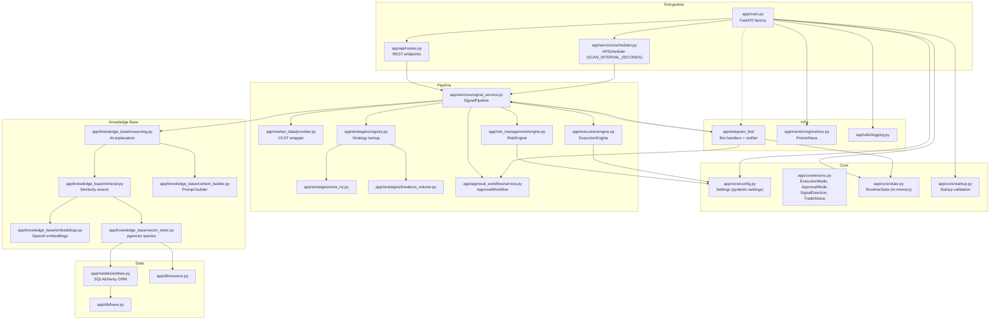

# Architecture Reference

## System Overview

The Crypto Telegram Bot is a **FastAPI** application that runs a periodic signal pipeline:

1. **Fetch** OHLCV market data from Binance via CCXT
2. **Analyze** with a pluggable trading strategy (EMA/RSI default)
3. **Validate** through risk management checks
4. **Execute** according to the active execution mode (signal_only, paper, live) and approval mode (auto, manual_approval)
5. **Notify** via Telegram with optional inline approval buttons
6. **Remember** via pgvector knowledge base for strategy context and historical trade memory

---

## Mode Model

The system uses **two independent mode axes**:

### Execution Mode
| Mode | Behavior |
|---|---|
| `signal_only` | Generate signals and send Telegram alerts. No trade execution. |
| `paper` | Simulate trades with slippage and fees against `PAPER_STARTING_BALANCE`. |
| `live` | Place real orders on the exchange. Requires `ENABLE_LIVE_TRADING=true` + API credentials. |

### Approval Mode
| Mode | Behavior |
|---|---|
| `auto` | Approved signals are executed immediately (subject to risk checks). |
| `manual_approval` | Approved signals require explicit human approval via Telegram inline buttons within `MANUAL_APPROVAL_TIMEOUT_SECONDS`. |

**Defaults**: `execution_mode=paper`, `approval_mode=manual_approval`

These two modes combine independently. For example:
- `paper` + `manual_approval` = paper trades require human approval via Telegram
- `paper` + `auto` = paper trades execute automatically after risk checks
- `signal_only` + `auto` = just sends alerts, no execution regardless of approval

---

## Dependency Graph



---

## Module Responsibilities

### `app/main.py` — Application Factory

- Creates the FastAPI instance.
- Calls `validate_runtime_settings()` to fail fast on bad config.
- Calls `init_runtime_state()` with configured modes, symbols, timeframes.
- Registers API routes and metrics router.
- Hooks scheduler start/stop and optionally Telegram bot start/stop to lifecycle events.

### `app/core/` — Configuration & Shared Types

| File | Purpose |
|---|---|
| `config.py` | `Settings` class via `pydantic-settings`. Reads `.env`. Exposes `symbol_list`, `timeframe_list`, and all strategy parameters. Singleton `settings` at module level. |
| `enums.py` | Enums: `ExecutionMode` (signal_only, paper, live), `ApprovalMode` (auto, manual_approval), `SignalDirection` (LONG, SHORT, HOLD), `TradeStatus`. All `str, Enum` for JSON serialization. |
| `state.py` | `RuntimeState` dataclass — in-memory store for current mode, signals, trades, positions, approvals. Will be replaced by DB persistence. |
| `startup.py` | Validates config at startup: blocks live mode without flag, requires symbols/timeframes, validates timeframe values, checks exchange credentials for live mode. |

### `app/services/` — Orchestration

| File | Purpose |
|---|---|
| `signal_service.py` | `SignalPipeline` — core orchestrator. For each `symbol × timeframe`: fetch candles → run strategy → get AI explanation → validate risk → route to approval/execution. |
| `scheduler.py` | APScheduler `BackgroundScheduler`. Interval = `SCAN_INTERVAL_SECONDS` (default 300 = 5 min). Skips if paused or signal_only mode. |

### `app/strategies/` — Signal Generation

| File | Purpose |
|---|---|
| `base.py` | `Strategy` ABC: abstract `generate(symbol, timeframe, candles) -> SignalContract`. |
| `ema_rsi.py` | EMA crossover + RSI filter. Configurable via `EMA_FAST`, `EMA_SLOW`, `RSI_PERIOD`, `RSI_LONG_THRESHOLD`, `RSI_SHORT_THRESHOLD`. Stop/take-profit via `STOP_LOSS_BUFFER_PERCENT`, `TAKE_PROFIT_R_MULTIPLE`. |
| `breakout_volume.py` | 20-period high/low breakout with volume confirmation. |
| `registry.py` | `STRATEGIES` dict. `build_strategy(name)` factory. Default strategy from `STRATEGY` env var. |

### `app/risk_management/engine.py` — Risk Validation

- `validate_signal()` — rejects HOLD signals, enforces `MIN_RISK_REWARD_RATIO`.
- `validate_runtime_limits()` — enforces `MAX_OPEN_POSITIONS`, `SIGNAL_COOLDOWN_MINUTES`.
- `validate_daily_loss()` — enforces `MAX_DAILY_LOSS_PERCENT` (pending implementation).
- `position_size()` — calculates quantity from balance × `RISK_PER_TRADE` / per-unit risk.

### `app/execution/engine.py` — Trade Execution

- Mode-aware execution returning `ExecutionResult(accepted, mode, details)`.
- `signal_only` → accepted, no trade placed.
- `paper` → simulated with slippage/fee against `PAPER_STARTING_BALANCE`.
- `live` → blocked unless `ENABLE_LIVE_TRADING=true` and exchange credentials present.

### `app/approval_workflow/service.py` — Manual Approvals

- Creates `PendingApproval` with UUID and expiry from `MANUAL_APPROVAL_TIMEOUT_SECONDS`.
- `decide()` checks expiry before accepting/rejecting.
- Integrates with Telegram inline buttons for approve/reject.

### `app/telegram_bot/` — Telegram Integration

| File | Purpose |
|---|---|
| `service.py` | `TelegramNotifier` — message formatting and sending. |
| `handlers.py` | Command handlers (/start, /help, /status, /signals, /positions, /balance, /mode, /pause, /resume, /why, /insights) and callback query handler for approvals. |
| `bot.py` | `Application` setup, handler registration, lifecycle. |
| `middleware.py` | Admin authorization check against `TELEGRAM_ADMIN_USER_ID`. |

### `app/knowledge_base/` — AI & Memory

| File | Purpose |
|---|---|
| `reasoning.py` | Calls OpenAI reasoning model (`REASONING_MODEL`) for signal explanations. Timeout + fallback. Advisory only. |
| `embeddings.py` | Calls OpenAI embedding API (`EMBEDDING_MODEL`, default `text-embedding-3-small`). |
| `retrieval.py` | pgvector similarity search over knowledge documents. |
| `context_builder.py` | Builds prompt context from signal + relevant documents + historical trade outcomes. |
| `vector_store.py` | SQLAlchemy/pgvector queries for document retrieval and ingestion. |

### `app/models/entities.py` — Database Schema

| Model | Table | Key Fields |
|---|---|---|
| `User` | `users` | `telegram_user_id`, `role` |
| `BotSetting` | `bot_settings` | `execution_mode`, `approval_mode`, `paused` |
| `Signal` | `signals` | Full signal data + `ai_explanation` |
| `Trade` | `trades` | FK to signals, `status`, `pnl`, `metadata_json` |
| `Position` | `positions` | FK to trades, `quantity`, `avg_price`, `status` |
| `KnowledgeDocument` | `knowledge_documents` | `source_type` (strategy_doc / trade_outcome), `title`, `content` |
| `KnowledgeEmbedding` | `knowledge_embeddings` | FK to documents, `Vector(1536)` |

### `app/monitoring/metrics.py` — Observability

- Prometheus counters: `signals_generated_total`, `trade_rejections_total`
- `/metrics` endpoint for scraping
- Extend with: `paper_trades_total`, `live_orders_total`, `approval_timeout_total`

---

## Data Flow: Signal Cycle

```
MarketDataProvider.fetch_ohlcv(symbol, timeframe)
        │
        ▼
   pd.DataFrame(OHLCV)
        │
        ▼
Strategy.generate(symbol, tf, df) → SignalContract
        │
        ▼
KnowledgeBase: retrieve relevant docs + similar historical setups
        │
        ▼
ReasoningEngine.explain(signal, context) → str  [ADVISORY ONLY]
        │
        ▼
RiskEngine.validate_signal(signal)           → (bool, note)
RiskEngine.validate_runtime_limits(state)    → (bool, note)
RiskEngine.validate_daily_loss(state)        → (bool, note)
        │
        ▼ approved = all checks pass
        │
    ┌───┴─────────────────────────────────┐
    │ approval_mode == manual_approval    │ approval_mode == auto
    │ AND risk-approved                   │ AND risk-approved
    ▼                                     ▼
ApprovalWorkflow.create()              ExecutionEngine.execute()
    │                                     │
    ▼                                     ▼
Telegram: signal + approve/reject      ExecutionResult
buttons (expires after timeout)        (paper trade / signal-only / live)
    │                                     │
    ▼                                     ▼
Human decision → execute()             Telegram: result notification
```

---

## Layer Boundaries

```
┌─────────────────────────────────┐
│          API Layer              │  app/api/
│   (HTTP endpoints, schemas)     │  app/schemas/
├─────────────────────────────────┤
│       Telegram Layer            │  app/telegram_bot/
│   (commands, callbacks, notify) │
├─────────────────────────────────┤
│        Service Layer            │  app/services/
│   (orchestration, scheduling)   │
├─────────────────────────────────┤
│        Domain Layer             │  app/strategies/
│   (strategies, risk, execution, │  app/risk_management/
│    approval, knowledge base)    │  app/execution/
│                                 │  app/approval_workflow/
│                                 │  app/knowledge_base/
├─────────────────────────────────┤
│         Core Layer              │  app/core/
│   (config, enums, state)        │
├─────────────────────────────────┤
│      Infrastructure Layer       │  app/db/
│   (database, monitoring,        │  app/models/
│    logging)                     │  app/monitoring/
│                                 │  app/utils/
└─────────────────────────────────┘
```

**Import rule**: Higher layers may import from lower layers. Never import upward.

| Layer | May Import From | Must Not Import From |
|---|---|---|
| `api/` | `core/`, `schemas/`, `services/`, `strategies/` | `db/`, `models/`, `telegram_bot/` |
| `telegram_bot/` | `core/`, `schemas/`, `services/`, domain modules | `api/` |
| `services/` | `core/`, `schemas/`, all domain modules | `api/`, `telegram_bot/` |
| `strategies/` | `core/`, `schemas/` | `services/`, `api/`, `db/`, `telegram_bot/` |
| `risk_management/` | `core/`, `schemas/` | `services/`, `api/`, `telegram_bot/` |
| `execution/` | `core/`, `schemas/` | `services/`, `api/`, `strategies/`, `telegram_bot/` |
| `knowledge_base/` | `core/`, `schemas/`, `models/`, `db/` | `services/`, `api/`, `telegram_bot/` |
| `models/` | `core/`, `db/` | Everything else |
| `db/` | `core/` | Everything else |
