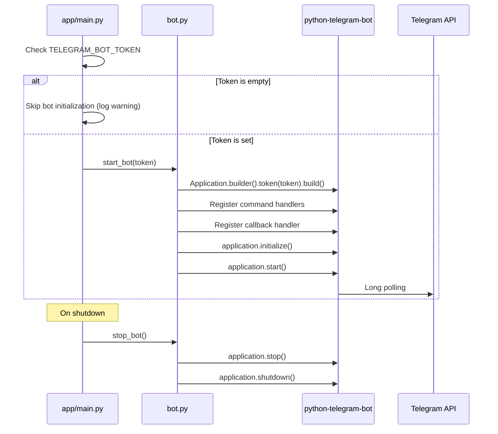
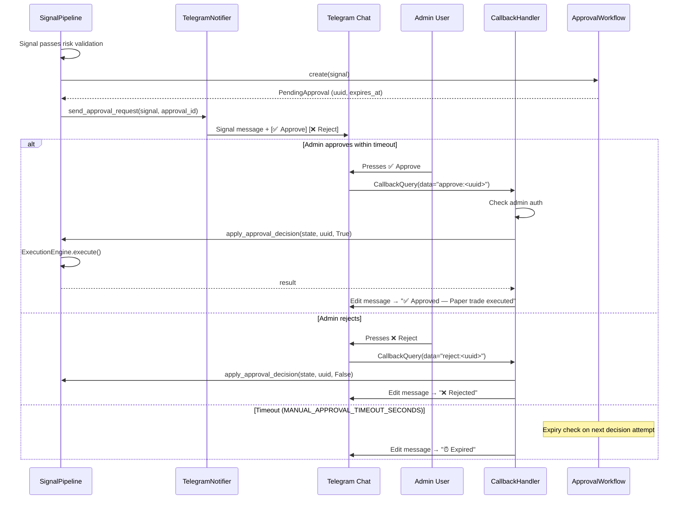

# Telegram Bot Integration Design

This document defines the full Telegram bot integration: commands, callback buttons, approval flow, notifications, and admin authorization.

---

## Current State vs Target

### What Exists
- `TelegramNotifier.build_signal_message()` — formats signal alert text
- `python-telegram-bot>=21.4` declared as dependency
- Config vars: `TELEGRAM_BOT_TOKEN`, `TELEGRAM_CHAT_ID`, `TELEGRAM_ADMIN_USER_ID` read by `Settings`

### What's Needed
- `Application` initialization and lifecycle management
- Command handlers for all 11 commands
- Callback query handler for approval buttons
- Proactive notification sending
- Admin authorization middleware
- Graceful degradation when token is empty

---

## File Structure

```
app/telegram_bot/
├── __init__.py
├── service.py          # TelegramNotifier — message formatting + sending (exists, extend)
├── handlers.py         # Command and callback handlers (NEW)
├── bot.py              # Application setup, handler registration, lifecycle (NEW)
└── middleware.py        # Admin auth check (NEW)
```

---

## Bot Lifecycle



Use **polling mode** for the MVP. Webhook mode is a future optimization.

---

## Commands (11 total)

All commands are **admin-only** unless marked otherwise.

| Command | Auth | Description | Response |
|---|---|---|---|
| `/start` | Public | Welcome message + capabilities | Text |
| `/help` | Public | List available commands | Text |
| `/status` | Admin | Current mode, paused state, symbols, strategy, pending approvals | Formatted text |
| `/signals` | Admin | Last 5 signals with direction and confidence | Formatted list |
| `/positions` | Admin | Open positions with entry price and current P&L | Formatted list |
| `/balance` | Admin | Paper balance or exchange balance (live mode) | Formatted text |
| `/mode` | Admin | Show or switch execution/approval mode | Text + confirmation |
| `/pause` | Admin | Pause the signal cycle | Confirmation |
| `/resume` | Admin | Resume the signal cycle | Confirmation |
| `/why` | Admin | Explain the most recent signal outcome (AI explanation) | Text |
| `/insights` | Admin | Aggregated signal analytics (long/short counts, recent outcomes) | Formatted text |

### Command Implementation Pattern

```python
from telegram import Update
from telegram.ext import ContextTypes

from app.core.state import get_runtime_state
from app.telegram_bot.middleware import require_admin


@require_admin
async def status_command(update: Update, context: ContextTypes.DEFAULT_TYPE) -> None:
    """Handle /status command."""
    state = get_runtime_state()
    text = (
        "📊 *Bot Status*\n"
        f"Execution mode: `{state.execution_mode.value}`\n"
        f"Approval mode: `{state.approval_mode.value}`\n"
        f"Paused: {'⏸️ Yes' if state.paused else '▶️ No'}\n"
        f"Symbols: {', '.join(state.symbols)}\n"
        f"Strategy: `{state.strategy}`\n"
        f"Pending approvals: {len(state.approvals)}\n"
    )
    await update.message.reply_text(text, parse_mode="Markdown")
```

---

## Admin Authorization

Implemented in `app/telegram_bot/middleware.py`:

```python
from functools import wraps

from telegram import Update
from telegram.ext import ContextTypes

from app.core.config import settings


def is_admin(user_id: int) -> bool:
    """Check if a Telegram user is the configured admin."""
    return str(user_id) == settings.telegram_admin_user_id


def require_admin(func):
    """Decorator that restricts a handler to the admin user."""
    @wraps(func)
    async def wrapper(update: Update, context: ContextTypes.DEFAULT_TYPE) -> None:
        user = update.effective_user
        if not user or not is_admin(user.id):
            await update.effective_message.reply_text("⛔ Unauthorized")
            return
        return await func(update, context)
    return wrapper
```

**Rules:**
- `/start` and `/help` are public — no auth check
- All other commands require admin
- All callback queries (approval buttons) require admin
- `TELEGRAM_ADMIN_USER_ID` must be set for admin features to work

---

## Manual Approval Flow (Callback Buttons)

When `approval_mode == manual_approval` and a signal passes risk checks:

### Flow



### Callback Data Format

```
approve:<approval_id>
reject:<approval_id>
```

### Inline Keyboard Builder

```python
from telegram import InlineKeyboardButton, InlineKeyboardMarkup


def build_approval_buttons(approval_id: str) -> InlineKeyboardMarkup:
    return InlineKeyboardMarkup([
        [
            InlineKeyboardButton("✅ Approve", callback_data=f"approve:{approval_id}"),
            InlineKeyboardButton("❌ Reject", callback_data=f"reject:{approval_id}"),
        ]
    ])
```

### Callback Handler

```python
@require_admin
async def approval_callback(update: Update, context: ContextTypes.DEFAULT_TYPE) -> None:
    """Handle approval button presses."""
    query = update.callback_query
    await query.answer()
    
    action, approval_id = query.data.split(":", 1)
    approved = action == "approve"
    
    state = get_runtime_state()
    result = pipeline.apply_approval_decision(state, approval_id, approved)
    
    status = result.get("result", "unknown")
    execution = result.get("execution", "")
    
    if status == "expired":
        emoji, label = "⏰", "EXPIRED"
    elif approved:
        emoji, label = "✅", "APPROVED"
    else:
        emoji, label = "❌", "REJECTED"
    
    await query.edit_message_text(
        f"{emoji} *{label}*\n"
        f"Approval: `{approval_id[:8]}...`\n"
        f"Execution: {execution}",
        parse_mode="Markdown",
    )
```

---

## Proactive Notifications

The bot proactively sends messages for these events:

| Event | Trigger | Message |
|---|---|---|
| **Signal generated** | After `run_cycle()` execution | Signal details + execution result |
| **Approval needed** | `manual_approval` mode, signal passes risk | Signal + inline approve/reject buttons |
| **Approval expired** | Decision attempted after timeout | Warning message |
| **Risk rejection** | `RiskEngine` returns `False` | Rejected signal + reason |
| **Scheduler error** | Exception in scheduled cycle | Error summary (no stack traces) |
| **Mode changed** | Via `/mode` command or API | Confirmation of new mode |
| **Bot paused/resumed** | Via `/pause` or `/resume` | Confirmation |

### Message Formatters

Extend `TelegramNotifier` with these additional methods:

```python
def build_signal_message(self, signal, ai_explanation, execution_mode, approval_mode) -> str:
    """Full signal alert with mode context."""

def build_rejection_message(self, signal, risk_note, limits_note) -> str:
    """Rejected signal notification."""

def build_approval_request(self, signal, approval_id, timeout_seconds) -> tuple[str, InlineKeyboardMarkup]:
    """Signal message + inline buttons for manual approval."""

def build_balance_message(self, balance, mode) -> str:
    """Paper or live balance display."""

def build_positions_message(self, positions) -> str:
    """Open positions with P&L."""
```

---

## Safety Rules for Telegram Integration

1. **Never auto-execute from Telegram** — callbacks must go through `apply_approval_decision()` → `ExecutionEngine`, never direct trade placement.
2. **Risk validation is mandatory** — approval decisions still route through the execution engine which respects all safety guards.
3. **Admin check on everything sensitive** — all commands except `/start` and `/help`, all callbacks.
4. **Rate limit messages** — `SCAN_INTERVAL_SECONDS` naturally limits; add a guard for manual triggers.
5. **No secrets in messages** — never send API keys, database URLs, or stack traces to Telegram.
6. **Graceful degradation** — empty `TELEGRAM_BOT_TOKEN` skips bot initialization. API works independently.
7. **Approval timeout** — `MANUAL_APPROVAL_TIMEOUT_SECONDS` enforced by `ApprovalWorkflow.decide()`.
